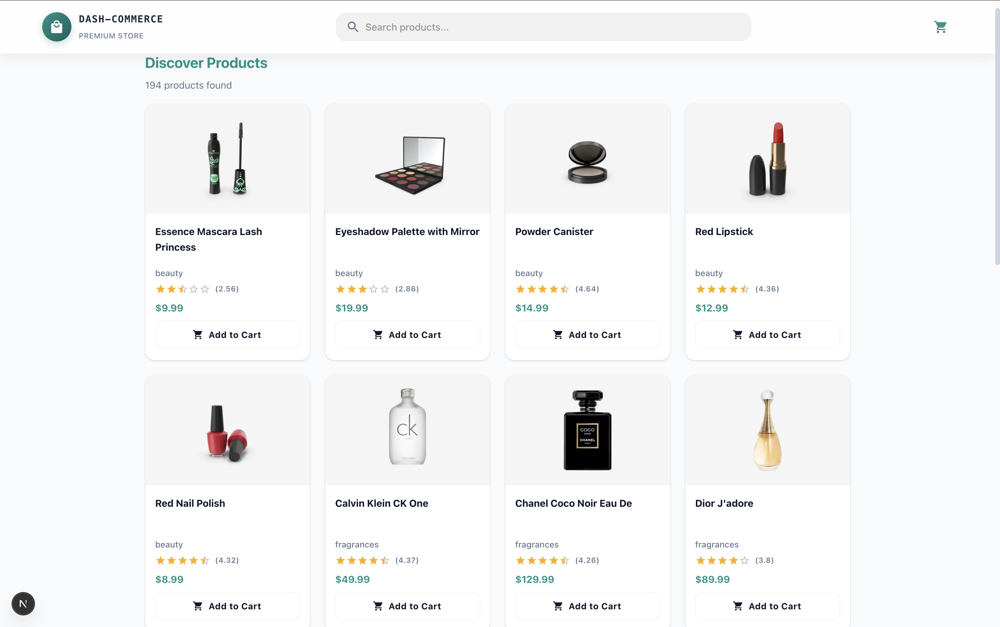
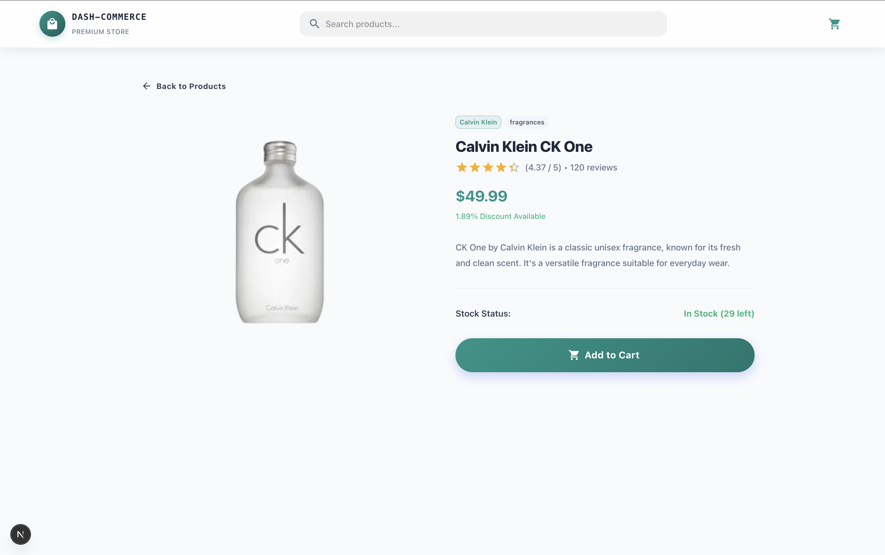
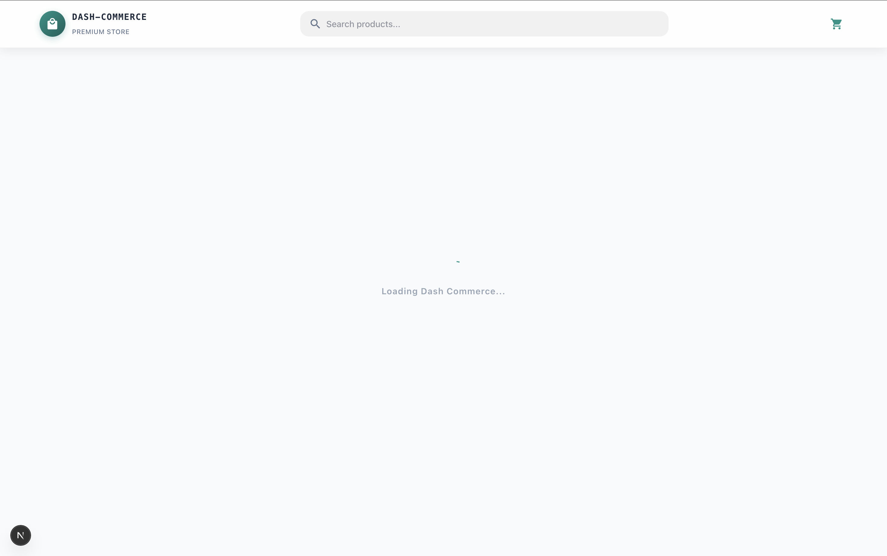
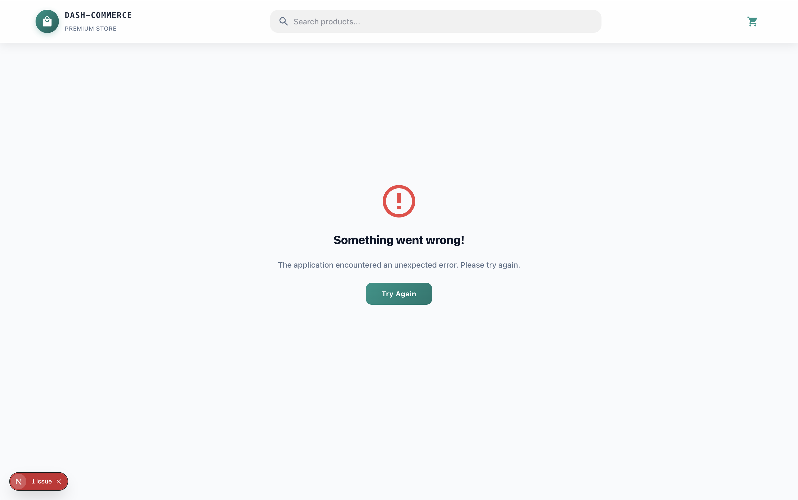

# Dash Commerce 🚀

Dash Commerce is a modern, responsive, and high-performance e-commerce dashboard built with Next.js 15+, MUI, and Redux Toolkit. It features a clean Teal & Slate aesthetic and is optimized for both speed and user experience.

## ✨ Features

- **Dynamic Product Listing**: Fast loading products with server-side rendering (SSR) and client-side pagination.
- **Advanced Search**: Real-time product search with debouncing for better performance.
- **Global State Management**: Powered by Redux Toolkit for seamless data flow across the app.
- **Professional Error Handling**: Custom error boundaries, system error pages, and Axios interceptors.
- **Premium UI/UX**: Built with Material UI (MUI) featuring custom animations and a branded design system.
- **Fast Performance**: Optimized loading states and efficient API integration.

## 🛠️ Tech Stack

- **Framework**: Next.js 15 (App Router)
- **Styling**: Material UI (MUI) & Emotion
- **State Management**: Redux Toolkit
- **API Client**: Axios
- **Language**: TypeScript

## 📸 Screenshots

### Product List Page



_**Key Features:**_

- **Dynamic Filtering:** Filter products by category with URL synchronization for shareability.
- **Smart Search:** Debounced search input (500ms) to reduce API calls and improve performance.
- **Stock Validation:** Out-of-stock items are visually distinguished (grayscale) and non-interactive.
- **Tech:** Uses `useSearchParams` for state persistence and Server Components for initial data fetching.

### Product Detail Page



_**Key Features:**_

- **Rich Media Gallery:** Interactive image slider with thumbnail navigation.
- **Persisted State:** Add-to-cart functionality with Redux Toolkit and LocalStorage persistence.
- **Responsive Design:** Adaptive layout using MUI Grid v2 (`size` prop) for different screen sizes.
- **Feedback:** Toast notifications upon adding items to the cart or favorites.

### Loading State



_**Key Features:**_

- **Skeleton UI:** Mimics the actual content layout to reduce perceived waiting time.
- **Prevention:** Prevents Layout Shift (CLS) by reserving space for incoming data.
- **Hybrid Approach:** Used during both initial SSR hydration and subsequent client-side navigation.

### Error State



_**Key Features:**_

- **Global Handling:** Centralized error boundary (`error.tsx`) catching both runtime and API errors.
- **Recovery:** "Try Again" button executes `reset()` to attempt re-rendering the segment without a full page reload.
- **Visuals:** Custom designed error illustrations matching the app's glassmorphism theme.

## 🚀 Getting Started

### Installation

1. Clone the repository:

   ```bash
   git clone <your-repository-url>
   ```

2. Install dependencies:

   ```bash
   npm install
   ```

3. Run the development server:

   ```bash
   npm run dev
   ```

4. Build for production:
   ```bash
   npm run build
   ```

## 📂 Project Structure

- `src/app`: Next.js App Router pages and layouts.
- `src/components`: Reusable UI components.
- `src/store`: Redux store, slices, and hooks.
- `src/api`: API services and Axios configuration.
- `src/types`: TypeScript interface and type definitions.
- `src/theme.ts`: Custom MUI theme configuration.

---

Developed with ❤️ by Berat MEN
